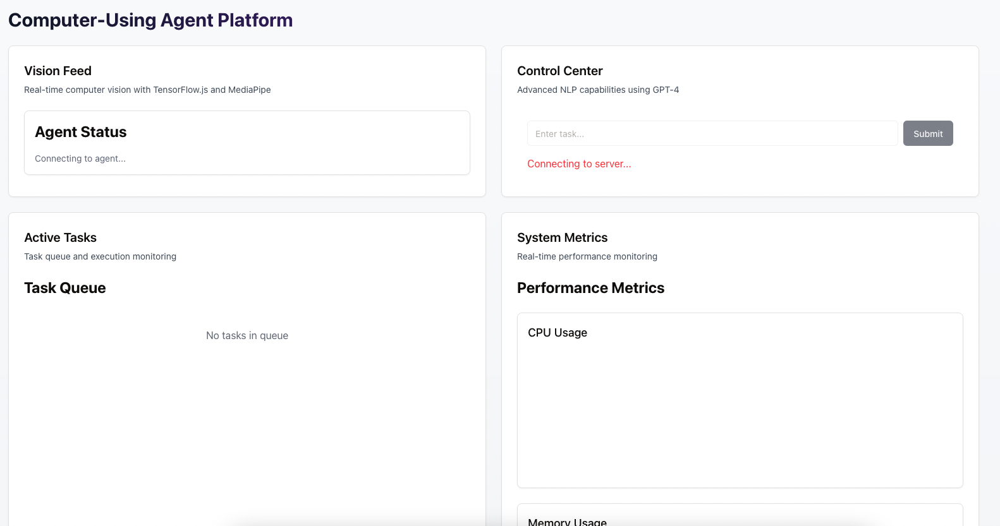

# learning about computer using agent tests

This project is an AI-powered task automation system with a web interface. Here's a simple breakdown:

Core Features:

    Users can submit tasks through a web interface
    Tasks are processed by AI models (NLP and Vision)
    Real-time monitoring of task execution
    Performance metrics tracking

Tech Stack:

    Frontend:

    React with TypeScript
    Vite for build/dev tooling
    Tailwind CSS for styling
    Socket.IO client for real-time updates

    Backend:

    Express.js server
    Socket.IO for WebSocket connections
    TypeScript for type safety
    AI Services:
        NLP Service for task parsing
        Vision Service for UI analysis
        TensorFlow.js for ML model execution

    Database:

    PostgreSQL (though not fully implemented in current code)

The architecture follows a client-server model with real-time communication via WebSockets. The frontend communicates with the backend through a REST API and WebSocket connection, while the backend processes tasks using AI services and maintains task queues.

Currently, there are some issues with WebSocket connections and OpenCV integration that need to be fixed for full functionality.

Based on the codebase, this project uses multiple AI models and services:

    GPT-4o (OpenAI's Latest Model) for NLP tasks in nlp.ts:

    Task parsing
    Action validation
    Used through OpenAI's API

    Venice AI API in nlpService.ts:

    Alternative NLP service
    Used for task parsing and validation
    Runs on "fastest" model configuration

    TensorFlow.js in visionService.ts:

    Custom UI element detection model
    Loaded from local model file: 'models/ui-detection/model.json'
    Used for visual processing of UI elements

    MediaPipe:

    Hand tracking and gesture recognition
    Integrated with the vision processing pipeline

The system appears to use a hybrid approach, combining both cloud AI services (GPT-4o, Venice) for language processing and local models (TensorFlow.js, MediaPipe) for vision and interaction tasks.